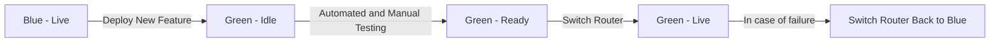

Interview Question: What is blue-green deployment? Can you provide an example of how it might be used?

Answer: Blue-Green deployment is a release management strategy that reduces downtime and risk by running two identical production environments, known as Blue and Green. At any time, only one of them is live. 

Blue is the live production environment that is currently running and serving all production traffic. Green is the idle environment. When a new version of an application is ready for release, the deployment is made in Green (the idle environment). After thorough testing in the Green environment, the router is switched and Green becomes the live environment and starts serving production traffic. If something unexpected occurs, the system can easily fall back to the Blue environment without any downtime as it has the previous version running. 

Example: An e-commerce company wants to release a new feature to their website. They deploy the new feature in the Green environment first while the Blue environment continues to serve the end-users. They run testing on the new feature in the Green environment. Once the company is satisfied the new feature functions as expected, they switch the router from the Blue to the Green environment. Now, the new feature is live and the Blue environment becomes idle. In the case where the new feature has bugs and causes breakdowns, the company can easily switch back to the Blue environment, ensuring their website remains up and running while they fix the bugs in the Green environment.

Diagram/Example:

