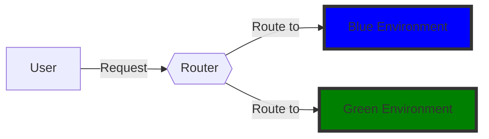

PVF1ZXN0aW9uOiBXaGF0IGlzIGJsdWUtZ3JlZW4gRGVwbG95bWVudD8gSG93
IGlzIGl0IHVzZWZ1bD8KCkFuc3dlcjogQmx1ZS1ncmVlbiBkZXBsb3ltZW50
IGlzIGEgbWV0aG9kb2xvZ3kgZm9yIHJlbGVhc2luZyBzb2Z0d2FyZSBpbiBh
IGNvbnRyb2xsZWQgYW5kIGxvdy1yaXNrIG1hbm5lci4gSXQgaW52b2x2ZXMg
Y3JlYXRpbmcgdHdvIGVudmlyb25tZW50cywgcmVmZXJyZWQgdG8gYXMgYmx1
ZSBhbmQgZ3JlZW4uIFRoZSBibHVlIGVudmlyb25tZW50IGlzIHRoZSBsaXZl
IHByb2R1Y3Rpb24gZW52aXJvbm1lbnQsIHNlcnZpbmcgYWxsIGNsaWVudCB0
cmFmZmljLCB3aGlsZSB0aGUgZ3JlZW4gZW52aXJvbm1lbnQgaXMgYW4gaWRl
bnRpY2FsIGNsb25lIHVzZWQgdG8gdGVzdCBhbmQgdmFsaWRhdGUgdGhlIG5l
dyB2ZXJzaW9uIG9mIHRoZSBhcHBsaWNhdGlvbi4KCk9uY2UgdGhlIG5ldyBz
b2Z0d2FyZSB2ZXJzaW9uIGlzIHJlYWR5IGFuZCBmdWxseSB0ZXN0ZWQgb24g
dGhlIGdyZWVuIGVudmlyb25tZW50LCB0aGUgdHJhZmZpYyBpcyBzd2l0Y2hl
ZCAob3IgZ3JhZHVhbGx5IG1vdmVkIGluIGNhc2Ugb2YgY2FuYXJ5IHRlc3Rp
bmcpIGZyb20gdGhlIGJsdWUgZW52aXJvbm1lbnQgdG8gdGhlIGdyZWVuIGVu
dmlyb25tZW50LiBXaXRoIHRoaXMgbWV0aG9kLCBpZiB0aGVyZSdzIGEgbmVl
ZCB0byByb2xsYmFjaywgaXQncyBhcyBzaW1wbGUgYXMgc3dpdGNoaW5nIGJh
Y2sgdGhlIHRyYWZmaWMgdG8gdGhlIHByZXZpb3VzIHZlcnNpb24uCgpUaGlz
IHN0cmF0ZWd5IGlzIHVzZWZ1bCBiZWNhdXNlIGl0IG1pbmltaXplcyBkb3du
dGltZSBkdXJpbmcgYXBwbGljYXRpb24gZGVwbG95bWVudC4gVGhlIGFwcGxp
Y2F0aW9uIHJlbWFpbnMgYXZhaWxhYmxlIHRvIHVzZXJzIHRocm91Z2hvdXQg
dGhlIGVudGlyZSBwcm9jZXNzLiBJdCBhbHNvIG9mZmVycyBhIGZhaWxzYWZl
4oCUc2hvdWxkIHNvbWV0aGluZyBnbyB3cm9uZywgcm9sbGJhY2sgaXMgZWFz
eSBhbmQgaW5zdGFudGFuZW91cyBieSByZS1yb3V0aW5nIHRoZSB0cmFmZmlj
IGJhY2sgdG8gdGhlIGJsdWUgZW52aXJvbm1lbnQgKHByZXZpb3VzIHZlcnNp
b24pLgoKRGlhZ3JhbS9FeGFtcGxlOgoKCkluIHRoaXMgZGlhZ3JhbSwgaW5p
dGlhbGx5LCBhbGwgcmVxdWVzdHMgYXJlIHJvdXRlZCB0byB0aGUgYmx1ZSBl
bnZpcm9ubWVudC4gV2hlbiBhIG5ldyBzb2Z0d2FyZSB2ZXJzaW9uIGlzIHJl
YWR5LCBpdCBpcyBkZXBsb3llZCB0byB0aGUgZ3JlZW4gZW52aXJvbm1lbnQu
IEFmdGVyIGl0IHBhc3NlcyBhbGwgdGVzdHMsIHRoZSByb3V0ZXIgc3RhcnRz
IHJvdXRpbmcgdGhlIHJlcXVlc3RzIHRvIHRoZSBncmVlbiBlbnZpcm9ubWVu
dC4gSWYgdGhlIG5ldyB2ZXJzaW9uIGZhaWxzIGluIHByb2R1Y3Rpb24gZm9y
IHNvbWUgcmVhc29uLCB0aGUgcm91dGVyIGdvZXMgYmFjayB0byByb3V0aW5n
IHJlcXVlc3RzIHRvIHRoZSBibHVlIGVudmlyb25tZW50LgpgYGAgbWVybWFp
ZApncmFwaCBMUgpBW1VzZXJdIC0tIFJlcXVlc3QgLS0+IEJ7e1JvdXRlcn19
CkIgLS0gUm91dGUgdG8gLS0+IENbQmx1ZSBFbnZpcm9ubWVudF0KQiAtLSBS
b3V0ZSB0byAtLT4gRFtHcmVlbiBFbnZpcm9ubWVudF0Kc3R5bGUgQyBmaWxs
OiMwMDAwZmYsc3Ryb2tlOiMzMzMsc3Ryb2tlLXdpZHRoOjRweApzdHlsZSBE
IGZpbGw6IzAwODAwMCxzdHJva2U6IzMzMyxzdHJva2Utd2lkdGg6NHB4

Question: What is blue-green Deployment? How is it useful?

Answer: Blue-green deployment is a methodology for releasing software in a controlled and low-risk manner. It involves creating two environments, referred to as blue and green. The blue environment is the live production environment, serving all client traffic, while the green environment is an identical clone used to test and validate the new version of the application.

Once the new software version is ready and fully tested on the green environment, the traffic is switched (or gradually moved in case of canary testing) from the blue environment to the green environment. With this method, if there's a need to rollback, it's as simple as switching back the traffic to the previous version.

This strategy is useful because it minimizes downtime during application deployment. The application remains available to users throughout the entire process. It also offers a failsafe—should something go wrong, rollback is easy and instantaneous by re-routing the traffic back to the blue environment (previous version).

Diagram/Example:

In this diagram, initially, all requests are routed to the blue environment. When a new software version is ready, it is deployed to the green environment. After it passes all tests, the router starts routing the requests to the green environment. If the new version fails in production for some reason, the router goes back to routing requests to the blue environment.

